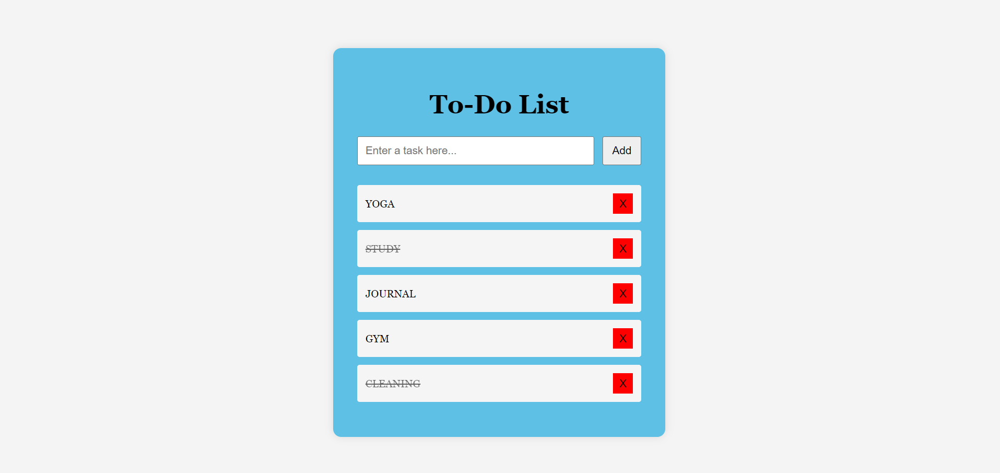

📌 Project Overview
This is a simple front-end To-Do List web application built using HTML, CSS, and Vanilla JavaScript.  
The app allows users to add tasks, mark them as complete, and delete them dynamically without reloading the page.
This project demonstrates basic DOM manipulation, event handling, and real-time UI updates using JavaScript.

Try the following:
- Add multiple tasks  
- Click task text to mark complete  
- Remove tasks  
- Attempt adding empty tasks  

All actions update instantly without reloading.
 📍Preview

